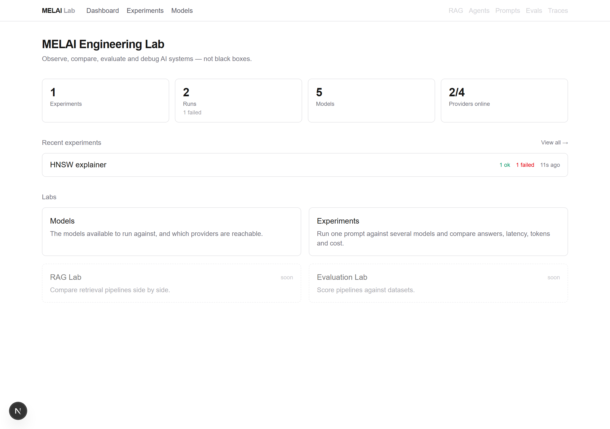
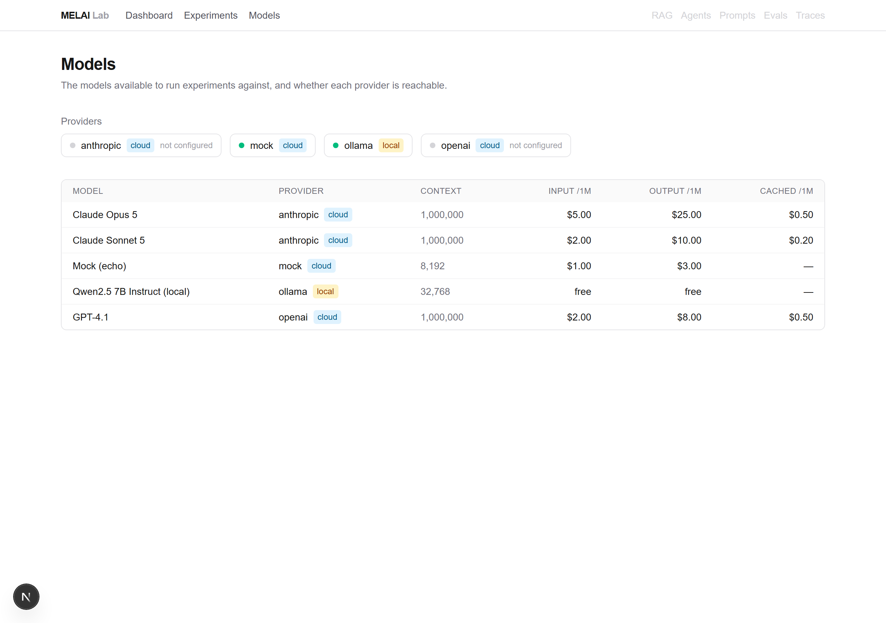
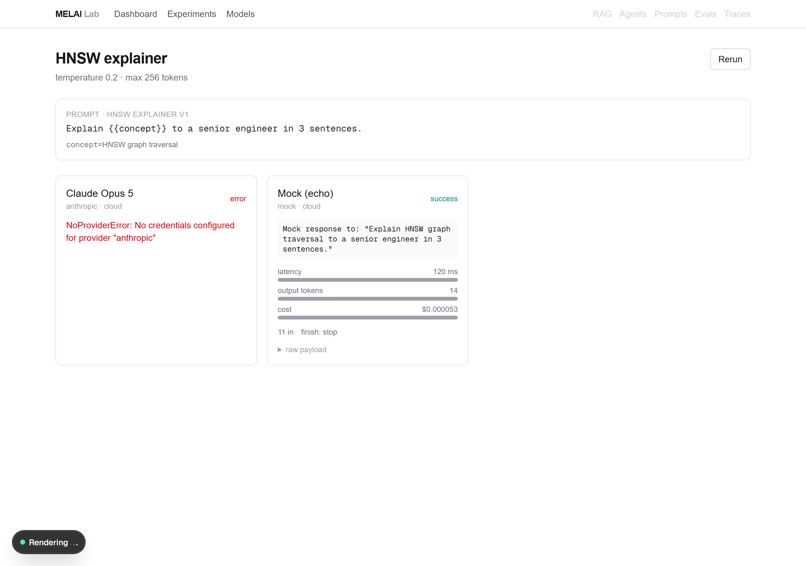

# MELAI Engineering Lab

[](https://github.com/OsamaAnsar/MELAI-Engineering-lab/actions/workflows/ci.yml)

An interactive lab to **observe, compare, evaluate and debug AI systems** — not another
chatbot UI. Run one prompt against several models at once and see the answers,
latency, tokens and cost side by side, with every request reproducible and every
number measured rather than guessed.



## Milestone 1 — Model Comparison Lab

The first lab is shipped: pick a prompt and a set of models (local Ollama, Anthropic,
OpenAI, or the built-in mock), run them concurrently, and watch results stream in.

| Models registry                        | Side-by-side results                     |
| -------------------------------------- | ---------------------------------------- |
|  |  |

Five more labs follow the same "observe → compare → evaluate → debug → improve" loop:
RAG, Evaluation, Agents, Local-AI observability, and a CLI + CI regression gate.

## Quick start (no Docker, no API keys)

Requires **Node ≥ 22** and **pnpm**.

```bash
pnpm install
pnpm db:seed     # creates an in-process PGlite database + seed models
pnpm dev         # api on :4000, web on :3000
```

Open <http://localhost:3000>, go to **Experiments → New experiment**, write a prompt,
pick **Mock (echo)**, and hit run. The mock provider echoes the prompt back with
deterministic latency/token/cost numbers, so the whole loop works with zero
configuration.

To use real models, add credentials to `.env` (no re-seed needed — the models are
already there, the provider just needs a key):

- `ANTHROPIC_API_KEY=...` / `OPENAI_API_KEY=...` — the provider turns green on the
  Models page once a key is present.
- `ollama pull qwen2.5:7b-instruct` — for the local model (Ollama on
  `OLLAMA_BASE_URL`, default `http://localhost:11434`).

## How it works

```
apps/
  web/    Next.js (App Router) — builder, history, live results
  api/    Fastify — experiment engine + REST + SSE
packages/
  ai-core/    ModelProvider interface, provider adapters, cost math, MockProvider
  database/   Drizzle schema, migrations, seed; Postgres or in-process PGlite
  shared/     Zod experiment spec, prompt templating, the API DTO types
```

- **Every provider is behind one `ModelProvider` interface.** The Anthropic, OpenAI
  and Ollama SDKs each report tokens and cache usage differently; the adapters
  normalise all of it to a single `TokenUsage`, and `packages/ai-core/src/cost.ts`
  is the only place model prices are applied. Cached input is always priced as the
  discounted portion, never double-counted.
- **The API is the source of truth for response shapes.** `packages/shared/src/dto.ts`
  defines the wire types; the API handlers are annotated against them and the web
  client imports them, so a drift is a type error.
- **Runs are asynchronous.** `POST /experiments` returns `202` with pending runs;
  `GET /experiments/:id/stream` is a Server-Sent Events stream of `run.started` /
  `run.completed` / `experiment.done`. The results page opens the stream and
  re-fetches on each event.
- **The dev database is in-process.** `DB_DRIVER=pglite` (the default) runs
  PGlite with the real migrations under `packages/database/.pglite` — no container.
  Set `DB_DRIVER=postgres` to use `DATABASE_URL` instead.

## Testing

```bash
pnpm lint && pnpm typecheck && pnpm test   # unit + integration
pnpm --filter @melai/web e2e               # Playwright happy path
```

Unit and integration tests run against PGlite and the `MockProvider` — no network,
no keys, no Docker. The provider adapters are contract-tested with a stubbed
`fetch`. The Playwright test drives the real stack end to end: build an experiment,
run it against the mock model, assert the result column reaches `success`.

## With a real Postgres

```bash
pnpm db:up          # docker compose: pgvector/pgvector:pg17 on :5432
# set DB_DRIVER=postgres in .env
pnpm db:migrate
pnpm db:seed
pnpm dev
```

## License

MIT
